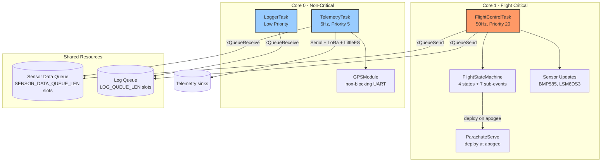

# Software Documentation - Onboard Computer

## Overview

The Flight Computer v2.0 firmware runs on an **ESP32-S3** (the v2.0 target
platform; the earlier ESP32-C3 SuperMini was used for the prototype/dev
firmware). It uses a FreeRTOS multi-task architecture, managing sensors,
communication and parachute control during flight.

**Version**: 2.0.0 (all phases complete)
**Architecture**: FreeRTOS-based OOP (Phases 1-10 complete)
**Hardware**: ESP32-S3 (v2.0 target; ESP32-C3 SuperMini used for prototype/dev)
**Team**: #11 - Serra Rocketry

## Architecture (v2.0)

The v2.0 refactoring introduces:

- **Object-oriented sensor abstraction** (`ISensor` interface)
- **Multi-task real-time architecture** (FreeRTOS, 2 cores)
- **Type-safe data sharing** (`SensorData` struct + queues)
- **Flight State Machine** — 4 outer states (IDLE → ASCENT → DESCENT → LANDED)
  with 7 internal sub-event flags (liftoff, burnout, apogee, freefall,
  parachute); validated with real flight data (1,873 points in
  `13_30_11-Dados.csv`) and RocketPy simulation.



## Project Structure (v2.0)

```
firmware/
├── firmware.ino                # Entry point (FreeRTOS setup + init*Task())
├── config.h                    # Pin definitions, thresholds, LoRa params
├── sensors/                    # OOP sensor abstraction (ISensor)
│   ├── ISensor.h               # Abstract interface (begin/update/getData/isReady)
│   ├── BMP585Sensor.h/.cpp     # Barometer (altitude, pressure, temp, Vz)
│   ├── LSM6DS3Sensor.h/.cpp    # IMU (accel + gyro)
│   └── GPSModule.h/.cpp        # GNSS (lat/lon/alt/sats, non-blocking)
├── modules/                    # Actuators & peripherals
│   ├── parachute_module.h      # ParachuteServo + setupServo() (servo owner)
│   ├── lora_module.h           # setupLoRa() / sendLoRa() (915 MHz)
│   ├── buzzer_module.h         # Status buzzer
│   └── filesystem_module.h     # LittleFS (writeFile/appendFile)
├── flight/                     # Flight logic (FreeRTOS tasks + FSM)
│   ├── SensorData.h            # SensorData struct + FlightState enum
│   ├── FlightStateMachine.h/.cpp  # FSM (4 states + 7 sub-events)
│   ├── FlightControlTask.h/.cpp   # Task 1 — 50 Hz (FSM + deploy + queue)
│   ├── TelemetryTask.h/.cpp       # Task 2 — 5 Hz (assemble + LoRa + file)
│   └── LoggerTask.h/.cpp          # Task 3 — low priority (log Serial)
├── REFACTORING_PLAN.md         # v2.0 architecture specification
├── MODULOS.md                  # Module documentation
└── docs -> ../docs             # telemetry-format.md (FSM/format reference)
```

## Component Mapping

### ISensor Interface → Implementations

| Interface | Sensor | Hardware | Status | Phase |
|-----------|--------|----------|--------|-------|
| `ISensor` | BMP585Sensor | Bosch BMP585 Barometer | Complete | 3 |
| `ISensor` | LSM6DS3Sensor | ST LSM6DS3 IMU | Complete | 4 |
| `ISensor` | GPSModule | u-blox NEO-8M GPS | Complete | 5 |
| - | LoRa Module | Semtech RFM95W (915 MHz) | Complete | 10 |
| - | Parachute Servo | MG92B Servo | Complete | 9 |

### Phases Completed

| Phase | Description | Status |
|-------|-------------|--------|
| 1 | Setup & project structure | Complete |
| 2 | Base interfaces (`ISensor`, `SensorData`) | Complete |
| 3 | BMP585Sensor | Complete |
| 4 | LSM6DS3Sensor | Complete |
| 5 | GPSModule | Complete |
| 6 | Flight State Machine (4 states + 7 sub-events) | Complete |
| 7 | FreeRTOS Tasks (FlightControl/Telemetry/Logger) | Complete |
| 8 | Integration (firmware.ino refactor) | Complete |
| 9 | Parachute deploy logic (Option A: apogee) + cleanup | Complete |
| 10 | Telemetry v2.0 format aligned with receiver | Complete |

## FreeRTOS Tasks

| Task | Core | Rate | Priority | Responsibility |
|------|------|------|----------|----------------|
| `taskFlightControl` | 1 | 50 Hz | 20 | Update sensors + FSM, deploy parachute at apogee, push `SensorData` to `sensorDataQueue`, feed TWDT |
| `taskTelemetry` | 0 | 5 Hz | 5 | Drain `sensorDataQueue` (newest sample), enrich with GPS, assemble CSV v2.0, fan-out to Serial + LoRa + LittleFS |
| `taskLogger` | 0 | event | 1 | Consume `logQueue`, print to Serial (level filter) |

Queues (defined in `config.h`):

- `sensorDataQueue` — between FlightControl and Telemetry.
- `logQueue` — between any task and Logger.

## Flight State Machine

See `firmware/REFACTORING_PLAN.md` Phase 6 for the full specification.

- **Outer states**: `IDLE → ASCENT → DESCENT → LANDED` (enum `FlightState`).
- **Sub-event flags** (diagnostic, set once): `liftoff`, `burnout`, `apogee`,
  `freefall`, `parachute`.
- **Parachute deploy (Option A)**: `detectParachute()` confirms apogee + stable
  negative `Vz` for `PARACHUTE_CONFIRM_CYCLES` cycles, never below
  `PARACHUTE_MIN_ALTITUDE` (50 m ground guard). FlightControlTask actuates the
  servo via `parachute_module`.

## Telemetry

The v2.0 telemetry format is defined in [`docs/telemetry-format.md`](telemetry-format.md)
(single source of truth). Summary:

- **Satellite → Receiver**: 22-field CSV
  `TEAM_ID,millis,count,altp,temp,umi,p,gx,gy,gz,ax,ay,az,vz,maxAltitude,state,alt,lat,lon,sat,parachute,rssi`
- **Receiver → WebUI**: 24-field CSV (inserts local GPS `hora`/`data` + real `rssi`).
- **Radio**: 915 MHz, SYNC 0xF3, SF7, BW 125 kHz, CR 4/5, TX +17 dBm, CRC on.
- **Local storage (LittleFS)**: same 22-field CSV header as the transmitted line.

## Storage (LittleFS)

- **Format**: CSV (22-field telemetry header, see `docs/telemetry-format.md`).
- **File name**: `HH_MM_SS-Dados.csv` (GPS time) or `{millis}-Dados.csv` if no fix.
- **Functions**: `setupLittleFS()`, `writeFile()`, `appendFile()`
  (`filesystem_module.h`).

## Communication

### Serial UART

- **Baud Rate**: 115200 (debug + real-time monitoring).

### LoRa (RFM95W)

- **Frequency**: 915 MHz (Americas/Brazil ISM).
- **Sync Word**: 0xF3.
- **Spreading Factor**: 7, **Bandwidth**: 125 kHz, **Coding Rate**: 4/5,
  **TX Power**: +17 dBm, **CRC**: on.
- **Range**: up to ~4 km (open field).

## Parachute (Option A)

- **Actuator**: `ParachuteServo` (owned by `parachute_module.h`); positions set
  by `setupServo()` and `deployParachute()`.
- **Decision**: FSM `detectParachute()` at apogee (validated: RocketPy apogee
  951 m → deploy 949.5 m; real flight apogee 272 m → deploy 268 m).
- **Guards**: `PARACHUTE_MIN_ALTITUDE = 50 m` (ground guard only);
  `PARACHUTE_CONFIRM_VZ = -2.0 m/s`; `PARACHUTE_CONFIRM_CYCLES = 3`.

## Build & Test

- **Arduino IDE**: Board `ESP32-S3 Dev Module` (the v2.0 target). The
  ESP32-C3 SuperMini build (`ESP32-C3 Dev Module`) works for the prototype
  firmware but pin assignments in `config.h` are C3-specific and must be
  re-mapped for the S3.
- **PlatformIO** (available): `platformio run -e esp32-c3`.
- **FSM validation**: `python3 extras/FSM_tester/FSM_Tester.py` (real data).
- **Telemetry validation**: `python3 extras/validate_telemetry_format.py`.

## Tests

Hardware tests in [`test/`](../test/):

- `test/basico/basico.ino` — basic init
- `test/buzzer/buzzer.ino` — buzzer
- `test/lora/lora.ino` — LoRa
- `test/testeGPS/testeGPS.ino` — GPS
- `test/servo/servo.ino` — servo
- `test/LittleFS/LittleFS.ino` — filesystem
- `test/FSM/FSM.ino` — FSM reference implementation (validated)

## Dependencies — Arduino Libraries

| Library | Use |
|---------|-----|
| Adafruit BMP585 | Pressure/altitude sensor |
| Adafruit LSM6DS3 | IMU |
| TinyGPS++ | GPS decoding |
| LoRa | RFM95W LoRa module |
| ESP32Servo | Servo control |
| Arduino_JSON / ArduinoJson | JSON (if used) |

## Development Notes

- **Safety**: parachute uses apogee + confirmed negative Vz; ground guard only.
- **Determinism**: FlightControlTask feeds the TWDT; telemetry is best-effort.
- **Logging**: all telemetry stored locally (LittleFS) before/with transmission.
- All code comments in English; UI strings in English; telemetry keys per
  firmware convention.
