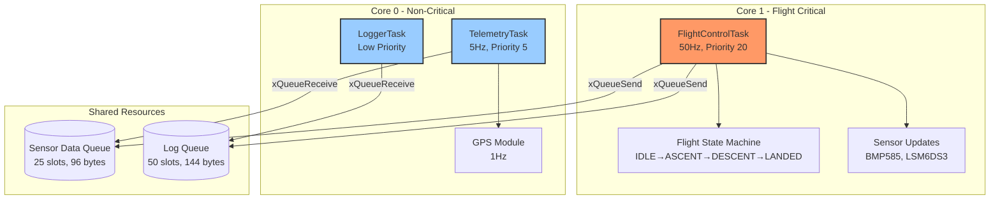

# Software Documentation - Onboard Computer

## Overview

The Flight Computer v2.0 firmware runs on an ESP32-S3 platform with a FreeRTOS multi-task architecture, managing sensors, communication and parachute control during flight. 

**Version**: 2.0.0-dev  
**Architecture**: FreeRTOS-based (Phases 1-5 completed)  
**Hardware**: ESP32-C3 SuperMini (current), ESP32-S3 (v2.0 target)  
**Team**: #100 - Serra Rocketry

## Architecture Overview

### v2.0 - Object-Oriented Design with FreeRTOS

The v2.0 refactoring introduces:
- **Object-oriented sensor abstraction** (ISensor interface)
- **Multi-task real-time architecture** (FreeRTOS)
- **Type-safe data sharing** (SensorData structures)
- **4-state flight state machine** (IDLE → ASCENT → DESCENT → LANDED)
  - Validated with real flight data (1,873 points in 13_30_11-Dados.csv)



### Project Structure (v2.0)

```
firmware/
├── firmware.ino                    # Main entry point (still v1.0, pending Phase 8)
├── config.h                        # Configuration constants
│
├── sensors/                        # ✅ Sensor abstraction layer (COMPLETE)
│   ├── ISensor.h                  # Abstract interface for all sensors
│   ├── BMP585Sensor.h/cpp         # Barometric pressure sensor (Phase 3) ✅
│   ├── LSM6DS3Sensor.h/cpp        # IMU: Accel + Gyro (Phase 4) ✅
│   └── GPSModule.h/cpp            # GNSS positioning (Phase 5) ✅
│
├── flight/                         # Flight control logic (Phase 6+)
│   ├── SensorData.h               # Shared data structures ✅
│   └── [pending]                  # FlightStateMachine, Tasks (Phase 6-7)
│
├── modules/                        # Legacy v1.0 modules (still in use)
│   ├── bmp280_sensor.h            # Still used (to be removed Phase 9)
│   ├── mpu6050_sensor.h           # Still used (to be removed Phase 9)
│   ├── gps_module.h               # Still used (to be removed Phase 9)
│   ├── lora_module.h
│   ├── filesystem_module.h
│   ├── parachute_module.h
│   └── buzzer_module.h
│
├── REFACTORING_PLAN.md            # v2.0 Architecture specification (v2.1)
└── MODULOS.md                     # Module documentation
```
firmware/
├── firmware.ino                    # Main entry point (FreeRTOS setup)
├── config.h                        # Configuration constants
│
├── sensors/                        # Sensor abstraction layer
│   ├── ISensor.h                  # Abstract interface for all sensors ⭐ NEW
│   ├── BMP585Sensor.h             # Barometric pressure sensor (Phase 3)
│   ├── LSM6DS3Sensor.h            # IMU: Accel + Gyro (Phase 3)
│   └── GPSModule.h                # GNSS positioning (Phase 3)
│
├── flight/                         # Flight control logic
│   ├── SensorData.h               # Shared data structures ⭐ NEW
│   ├── FlightStateMachine.h       # 7-state FSM (Phase 4)
│   ├── FlightControlTask.h        # Main flight control task (Phase 4)
│   └── ParachuteControl.h         # Parachute deployment logic (Phase 4)
│
├── modules/                        # Refactored modules
│   ├── TelemetryTask.h            # Telemetry & GPS task (Phase 4)
│   ├── LoggerTask.h               # Data logging task (Phase 4)
│   ├── LoRaModule.h               # LoRa communication (Phase 5)
│   └── WebServer.h                # WiFi web interface (Phase 5)
│
├── REFACTORING_PLAN.md            # v2.0 Architecture specification
├── MODULOS.md                     # Module documentation
└── [old files]                    # v1.0 procedural code (for reference)
    ├── bmp280_sensor.h
    ├── mpu6050_sensor.h
    └── gps_module.h
```

## Component Mapping

### ISensor Interface → Implementations

| Interface | Sensor | Hardware | Status | Phase |
|-----------|--------|----------|--------|-------|
| `ISensor` | BMP585Sensor | Bosch BMP585 Barometer | ✅ Complete | 3 |
| `ISensor` | LSM6DS3Sensor | ST Microelectronics LSM6DS3 IMU | ✅ Complete | 4 |
| `ISensor` | GPSModule | u-blox NEO-8M GPS | ✅ Complete | 5 |
| - | LoRa Module | Semtech RFM95W | ⏳ Planned | - |
| - | Servo Control | MG92B Servo | ⏳ Legacy (v1.0) | - |

### Phases Completed

#### ✅ Phase 1: Setup & Structure (2026-04-06)
- Created sensor abstraction layer (`firmware/sensors/`)
- Reorganized firmware into modular structure
- Created `firmware/flight/` directory for flight control logic

#### ✅ Phase 2: Base Interfaces (2026-04-06)
- Implemented `ISensor.h` - abstract interface for all sensors
- Implemented `SensorData.h` - shared data structures for inter-task communication
- Added Doxygen documentation for all interfaces (English only)
- Passed safety-critical code review

#### ✅ Phase 3: BMP585Sensor (2026-04-06)
- BMP585Sensor.h/cpp - Barometric pressure + altitude calculation
- Vertical velocity calculation via numerical differentiation
- NaN/Inf validation, range clipping (±200 m/s)

#### ✅ Phase 4: LSM6DS3Sensor (2026-04-06)
- LSM6DS3Sensor.h/cpp - Accelerometer + Gyroscope
- Total acceleration magnitude calculation
- Safety validations: NaN/Inf rejection, range checking (200 m/s², 2000 °/s)

#### ✅ Phase 5: GPSModule (2026-05-06)
- GPSModule.h/cpp - GNSS positioning
- Non-blocking NMEA parsing via TinyGPS++
- HardwareSerial dependency injection for flexibility

#### ⏳ Phase 6: Flight State Machine (Planned)
- [ ] FlightStateMachine.h - 4-state FSM (IDLE → ASCENT → DESCENT → LANDED)
- [ ] State transition logic with safety guards
- [ ] Parachute deployment integration

#### ⏳ Phase 7: FreeRTOS Tasks (Planned)
- [ ] FlightControlTask - Core 1, 50Hz, Priority 20
- [ ] TelemetryTask - Core 0, 5Hz, Priority 5
- [ ] LoggerTask - Core 0, low priority

#### ⏳ Phase 8: Integration (Planned)
- [ ] Refactor firmware.ino to use new classes
- [ ] Integrate with legacy modules

#### ⏳ Phase 9: Cleanup (Planned)
- [ ] Remove legacy sensor modules (bmp280_sensor.h, mpu6050_sensor.h, gps_module.h)

## Main File (Legacy v1.0 Architecture)

- **[firmware.ino](../firmware/firmware.ino)** - Main code with setup and loop (v1.0)

### Code Organization (v1.0 - Procedural)

```
setup()                 // Initialization of all components
├── setupLittleFS()     // File system
├── setupBMP()          // Pressure sensor
├── setupMPU()          // IMU
├── setupLoRa()         // Communication
└── setupServo()        // Servo motor

loop()                  // Continuous execution
├── readSensors()       // Data collection
├── handleParachute()   // Parachute control
├── logData()           // Storage
└── sendLoRa()          // Transmission
```

## Modules and Sensors

### 1. BMP280 - Barometric Pressure Sensor

**Function**: Measure altitude and atmospheric pressure

**Libraries**:

- `Adafruit_BMP280`
- `Wire` (I2C)

**Collected Data**:

- Relative altitude (m)
- Pressure (hPa)
- Base pressure (calibrated at setup)

**Test Code**: [test/basico/basico.ino](../test/basico/basico.ino)

**Related Variables**:

```cpp
float base_altitude    // Initial altitude (reference)
float base_pressure    // Base pressure (hPa)
float previous_altitude // Previous height (for velocity calculation)
float max_altitude     // Maximum height reached
```

### 2. MPU6050 - IMU (Accelerometer + Gyroscope)

**Function**: Measure acceleration and rotation (flight dynamics data)

**Libraries**:

- `Adafruit_MPU6050`
- `Adafruit_Sensor`
- `Wire` (I2C)

**Collected Data**:

- Acceleration in X, Y, Z (m/s²)
- Angular velocity in X, Y, Z (rad/s)
- Sensor temperature (°C)

**Related Variables**:

```cpp
sensors_event_t acc, gyr, temp  // Acceleration, gyroscope and temperature events
```

### 3. NEO-6M - GPS Module

**Function**: Get latitude, longitude, GPS altitude and time

**Libraries**:

- `TinyGPS++`
- Serial UART communication

**Communication Pins**:

- **RX_GPS**: Pin 20 (receives data from GPS)
- **TX_GPS**: Pin 21 (sends data to GPS)

**Collected Data**:

- Latitude (°)
- Longitude (°)
- GPS Altitude (m)
- Number of satellites
- Date and time UTC

**Features**:

- Waits 3 seconds in setup for synchronization
- Uses GPS time to name log file

### 4. RFM95W - LoRa Module

**Function**: Long-range wireless communication with the base

**Frequency**: 868 MHz

**Libraries**:

- `LoRa`
- `SPI`

**Communication Pins**:

- **SS_LORA**: Pin 7 (Chip Select)
- **RST_LORA**: Pin 1 (Reset)
- **DIO0_LORA**: Pin 2 (Interrupt)

**Configuration**:

```cpp
#define LORA_FREQ 868E6      // Frequency
#define SYNC_WORD 0xF3       // Sync code
```

**Transmitted Data**: Concatenated string with data from all sensors in CSV format

### 5. Servo Motor - Parachute Control

**Function**: Open parachute at appropriate altitude

**Pin**: **SERVO_PIN = 3**

**Positions**:

- **MAXPOS = 0°** (Parachute closed)
- **MINPOS = 90°** (Parachute open)

**Opening Criteria**:

```cpp
const float ALTITUDE_THRESHOLD = 750.0      // Minimum height (m)
const float ALTITUDE_DROP_THRESHOLD = 10.0  // Minimum drop from peak (m)
const float VELOCITY_THRESHOLD = 80.0        // Descent velocity minimum (m/s)
```

**Control Function**: `handleParachute()`

### 6. Buzzer - Signaling

**Function**: Indicate initialization status and operation

**Pin**: **BUZZER_PIN = 0**

**Signals**:

- **Alert**: Multiple short beeps (initialization failure)
- **Success**: Beep sequence (components started correctly)

**Control Function**: `buzzSignal()`

## Storage System

### LittleFS - File System

**Function**: Store telemetry data in real time

**File Format**: CSV

**File Name**:

- If GPS is synchronized: `HH_MM_SS-Dados.csv` (GPS time)
- If GPS not synchronized: `{millis}-Dados.csv`

**CSV Header**:

```csv
ID,Packet,Time,Latitude,Longitude,GPS_Altitude,Satellites,Date,Hours,Minutes,Seconds,
BMP_Altitude,Pressure,AccX,AccY,AccZ,GyroX,GyroY,GyroZ,Temp,ParachuteStatus
```

**File Functions**:

- `setupLittleFS()` - Initializes the system
- `writeFile()` - Creates new file with header
- `appendFile()` - Adds line to file

## Communication

### Serial UART

- **Baud Rate**: 115200
- **Use**: Debug and real-time monitoring

### LoRa

- **Range**: Up to ~4 km (in open field)
- **Data Rate**: ~1-5 kbps
- **Frequency**: 868 MHz

## Web Interface

**Functionality**: Asynchronous server on port 80

**Endpoints**:

- `GET /` - Home page (HTML)
- `GET /api/files` - List files in JSON
- `GET /api/file?name=` - Download file
- `DELETE /api/file?name=` - Delete file

**Libraries**:

- `ESPAsyncWebServer`
- `WiFi`
- `ArduinoJson`

## Adjustable Parameters

```cpp
#define INTERVAL 200                              // Reading interval (ms)
const float ALTITUDE_THRESHOLD = 750.0            // Minimum height for parachute (m)
const float ALTITUDE_DROP_THRESHOLD = 10.0        // Drop from reference (m)
const float VELOCITY_THRESHOLD = 80.0              // Descent velocity minimum (m/s)
const String TEAM_ID = "#100"                     // Team ID
```

## Execution Flow

1. **Initialization** (setup)
   - Configure serial communication
   - Initialize I2C and SPI
   - Wait for GPS synchronization (3s)
   - Create log file
   - Initialize sensors and modules
   - Start web server

2. **Main Loop**
   - Check 200ms interval
   - Read altitude and IMU
   - Calculate descent velocity
   - Check parachute opening criteria
   - Record data in file
   - Transmit via LoRa

3. **Parachute Control**
   - Wait for minimum height
   - Monitor drop relative to peak
   - Check descent velocity
   - Open servo when all criteria are met

## Support Code

The files in [extras/](../extras/) contain functional and tested code for reference:

- **[extras/ino_files/](../extras/ino_files/)** - Earlier versions of integrated code
- **[extras/FileBrowser/FileBrowser.ino](../extras/FileBrowser/FileBrowser.ino)** - File browser, base for async server
- **[extras/LoraReceiver/LoraReceiver.ino](../extras/LoraReceiver/LoraReceiver.ino)** - LoRa receiver for base
- **[extras/Serial/Serial.py](../extras/Serial/Serial.py)** - Python script for serial monitoring

## Tests

Unit tests are located in [test/](../test/):

- **[test/basico/basico.ino](../test/basico/basico.ino)** - Basic initialization test
- **[test/buzzer/buzzer.ino](../test/buzzer/buzzer.ino)** - Buzzer test
- **[test/lora/lora.ino](../test/lora/lora.ino)** - LoRa communication test
- **[test/testeGPS/testeGPS.ino](../test/testeGPS/testeGPS.ino)** - GPS module test
- **[test/servo/servo.ino](../test/servo/servo.ino)** - Servo motor test
- **[test/LittleFS/LittleFS.ino](../test/LittleFS/LittleFS.ino)** - File system test

## Dependencies - Arduino Libraries

| Library           | Version | Use                |
| ----------------- | ------- | ------------------ |
| Adafruit BMP280   | Latest  | Pressure sensor    |
| Adafruit MPU6050  | Latest  | IMU                |
| Adafruit Sensor   | Latest  | Sensor base        |
| TinyGPS++         | Latest  | GPS decoding       |
| LoRa              | Latest  | LoRa module        |
| ESP32Servo        | Latest  | Servo control      |
| ArduinoJson       | ^6.0    | JSON serialization |
| ESPAsyncWebServer | Latest  | Web server         |

## Development Notes

- **Synchronization**: The system waits for GPS synchronization before flight starts
- **Redundancy**: The parachute uses multiple criteria to prevent incorrect opening
- **Logging**: All data is stored locally before transmission via LoRa
- **Power Efficiency**: The ESP32 operates in continuous mode during flight
